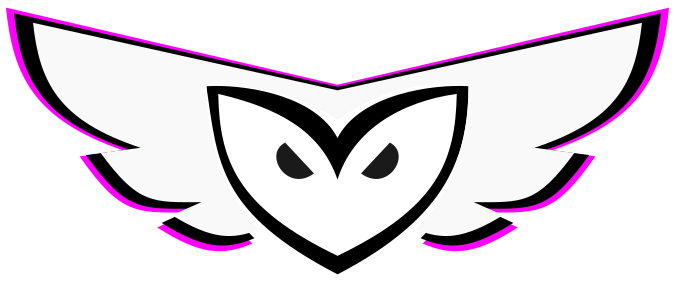

# 🦉 KamiYomu — Your Self-Hosted Manga Crawler



**KamiYomu** is a powerful, extensible manga crawler built for manga enthusiasts who want full control over their collection. It scans and downloads manga from supported websites, stores them locally, and lets you host your own private manga reader—no ads, no subscriptions, no limits.

---

## ✨ Features

- 🔍 **Automated Crawling**  
  Fetch chapters from supported manga sites with ease.

- 💾 **Local Storage**  
  Keep your manga files on your own server or device.

- 🧩 **Plugin Architecture**  
  Add support for new sources or customize crawling logic.

- 🛠️ **Built with .NET Razor Pages**  
  Lightweight, maintainable, and easy to extend.

---

## 🚀 Why KamiYomu?

Whether you're cataloging rare series, powering a personal manga dashboard, or seeking a cleaner alternative to bloated online readers, KamiYomu puts you in control of how you access and organize manga content. It’s a lightweight, developer-friendly crawler built for clarity, extensibility, and respectful use of publicly accessible sources. Content availability and usage rights depend on the licensing terms of each source — KamiYomu simply provides the tools.

---

## Requirements

- [Docker](https://www.docker.com/get-started)


## 📦 Getting Started

save the following `docker-compose.yml` file to run KamiYomu with Docker:

```yml
services:
    kamiyomu:
      image: marcoscostadev/kamiyomu:1.0.0-beta2
      ports:
        - "8080:8080" # HTTP Port
      envelopment:
        - Settings__Worker__WorkerCount=3 # Number of concurrent crawler agents excecuting
      restart: unless-stopped
      healthcheck:
        test: ["CMD", "curl", "-f", "https://localhost:8080/healthz"]
        interval: 30s
        timeout: 10s
        retries: 3
      volumes:
        - ./AppData/manga:/manga # Your desired local path for manga storage 
        - Kamiyomu_database:/db
        - kamiyomu_agents:/agents 
        - kamiyomu_logs:/logs 

volumes:
      kamiyomu_agents:
      Kamiyomu_database:
      kamiyomu_logs:
```

In the folder where you saved the `docker-compose.yml` file, run:

```bash
    docker-compose up -d
```
You will have access to the web interface at `http://localhost:8080`.
Keep in mind to map the volumes to your desired local paths. 
See the releases branchs for identifying the versions available.

Configure your sources and crawler agents 

Download crawler agents from NuGet Package from [here](https://github.com/orgs/KamiYomu/packages) and upload them in [Crawler Agents](http://localhost:8080/Settings/CrawlerAgents).

## 👨‍💻 Contributing
1. Fork the repository
2. Create your feature branch (`git checkout -b feature/AmazingFeature`)
3. Commit your changes (`git commit -m 'Add some AmazingFeature'`)
4. Push to the branch (`git push origin feature/AmazingFeature`)
5. Open a Pull Request against the ``develop`` branch


## 🛠️ Development Setup

We recommend using Visual Studio 2022 or later with the .NET 8 SDK installed. However, you can also run KamiYomu using VsCode.

### Using Visual Studio

- Visual Studio: [Download here](https://visualstudio.microsoft.com/downloads/)
- .NET 8 SDK: [Download here](https://dotnet.microsoft.com/en-us/download/dotnet/8.0)
- Docker: [Download here](https://www.docker.com/get-started)


1. **Clone the repository**
   ```bash
   git clone https://github.com/KamiYomu/KamiYomu.Web.git
	```
2. Open the solution in Visual Studio in `/src/KamiYomu.Web.sln`
3. Set `docker-compose` project as startup project and run it.


### Using VsCode

To get started with local development using Visual Studio Code, ensure the following tools are installed:

**Required Tools**

- Visual Studio Code [Download Here](https://code.visualstudio.com/)
- C# Dev Kit Extension [Install](https://marketplace.visualstudio.com/items?itemName=ms-dotnettools.csdevkit)
- Docker Extension for VS Code [Install](https://marketplace.visualstudio.com/items?itemName=ms-azuretools.vscode-docker)

Note: Make sure Docker is installed and running on your machine.

1. Clone the Repository

```bash
    git clone https://github.com/KamiYomu/KamiYomu.Web.git
```
2. Running the Project in VS Code
- Open the project folder in VS Code.
- Navigate to the "Run and Debug" tab (Ctrl+Shift+D).
- Select the launch configuration: "Attach to .NET Core in Docker".
- Click the ▶️ Start Debugging button.
The project includes predefined tasks to build and run the Docker container automatically.


## 🧠 Tech Stack- .NET 8 Razor Pages
- Hangfire for job scheduling
- LiteDB for lightweight persistence
- HTMX + Bootstrap for dynamic UI
- Plugin-based architecture for source extensibility

## 📜 License
This project is licensed under GPL-3.0. See the LICENSE file for details.

## 🤝 Contributing
Pull requests are welcome! If you have ideas for new features, plugin sources, or UI improvements, feel free to open an issue or submit a PR.

## 💬 Contact
Questions, feedback, or bug reports? Reach out via GitHub Issues or start a discussion.