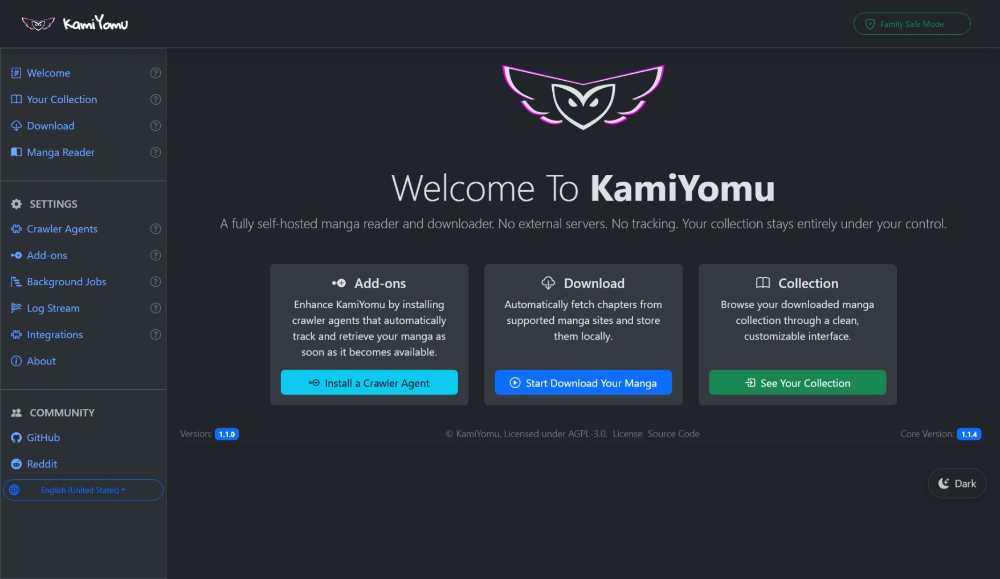

# KamiYomu — A self-hosted, extensible manga reader and download tool


**KamiYomu** is a high-performance, extensible manga manager designed for enthusiasts who demand total control. 

By leveraging a modular **Crawler Agent** architecture, KamiYomu empowers you to discover, download, reading, and archive manga from any supported source into a private, self-hosted library.

> [!NOTE]
> **Total Extensibility:** If a site isn't supported yet, you can build your own Crawler Agent in C# and integrate it instantly.

### 🚀 Core Capabilities
* **Modular Crawling:** Support for any website via community-driven **Crawler Agents**.
* **Local Archival:** Download and store high-quality images in a structured local library.
* **Private Hosting:** A built-in web reader to access your collection from any device, anywhere.
* **Developer Friendly:** Comprehensive SDK and Validator tools for building custom agents.
[📖 Read the docs](https://kamiyomu.github.io)

---

[](https://github.com/orgs/KamiYomu/followers)
[](https://github.com/kamiyomu/kamiyomu/stargazers)
[](https://github.com/kamiyomu/kamiyomu/graphs/contributors)
[](https://github.com/kamiyomu/kamiyomu/issues)
[](https://github.com/kamiyomu/kamiyomu/blob/main/LICENSE)

---

## 💬 Community

Join the conversation and be part of the KamiYomu community:

[](https://github.com/KamiYomu/KamiYomu/discussions)

---

## 🚀 Why KamiYomu?

Whether you're cataloging rare series, powering a personal manga dashboard, or seeking a cleaner alternative to bloated online readers, KamiYomu puts you in control. It's a lightweight, developer-friendly crawler built for clarity, extensibility, and respectful use of publicly accessible sources.



## 📋 Requirements

- [Docker](https://www.docker.com/get-started)

## 📦 Getting Started

1. Save the following `docker-compose.yml` file:

```yml
services:
  kamiyomu:
    image: marcoscostadev/kamiyomu:latest
    ports:
      - "8080:8080"
    restart: unless-stopped
    healthcheck:
      test: ["CMD", "curl", "-f", "http://localhost:8080/healthz"]
      interval: 30s
      timeout: 10s
      retries: 3
    volumes:
      - /etc/localtime:/etc/localtime:ro # Sync time with host
      - kamiyomu_manga:/manga
      - kamiyomu_database:/db
      - kamiyomu_agents:/agents
      - kamiyomu_logs:/logs
volumes:
  kamiyomu_manga:
  kamiyomu_database:
  kamiyomu_agents:
  kamiyomu_logs:
```

2. Run the following command in the directory containing `docker-compose.yml`:

```bash
docker-compose up -d
```

3. Access the web interface at `http://localhost:8080`

> [!NOTE]
> Map volumes to local paths as needed. Check [releases](https://github.com/KamiYomu/releases) for available versions.


## 🧠 Tech Stack

- .NET 8 Razor Pages
- Hangfire for job scheduling
- LiteDB for lightweight persistence
- HTMX + Bootstrap for dynamic UI
- Plugin-based architecture for extensibility

----

## ⚠️ What KamiYomu Does and Does Not

### ✅ Does

- A robust, self-hosted web interface designed for seamless reading across desktop and mobile.
- Orchestrate and schedule crawler agent tasks (search, list, get, etc.)
- Download images from websites that the crawler agent specify
- Create local archives from downloaded images in specified folder location.
- Allow you to export archives as PDF, CBZ, or ZIP files to your local storage
- Provide a user-friendly web interface for managing your manga library.

### ❌ Does Not

- Invade sites or exploit vulnerabilities to access sensitive information
- Extract database, protected data information from websites
- Extract non-public information (such as website login credentials, API keys, etc)
- Store any files, data, or metadata on KamiYomu servers
- Track or monitor crawler activity across KamiYomu instances
- Enable peer-to-peer sharing or inter-instance communication
- Cache or retain downloaded content in KamiYomu servers
- Distribute, share, or redistribute downloaded content from KamiYomu instances to other users or platforms.

### User Responsibility and Disclaimer

By using KamiYomu, you agree that you are solely responsible for all downloaded content, file management, and usage. KamiYomu is provided as-is for local use only. The developers and maintainers of KamiYomu assume no responsibility for your use of this tool, including but not limited to compliance with copyright laws, licensing agreements, or the terms of service of any source websites. You assume full liability for any legal consequences arising from your use of KamiYomu.

## 📃 License

The KamiYomu project is licensed under the **AGPL-3.0 (Affero General Public License version 3.0)**. This license allows users to freely use, modify, and distribute the software, provided that any modified versions are also distributed under the same license. 

### Key Points of AGPL-3.0:
- **Freedom to Use**: Users can run the software for any purpose.
- **Freedom to Study and Modify**: Users can access the source code and modify it to suit their needs.
- **Freedom to Distribute Copies**: Users can share the original software with others.
- **Freedom to Distribute Modified Versions**: Users can distribute modified versions of the software, but they must also be licensed under AGPL-3.0, ensuring that the same freedoms are preserved for all users.
---

## 🤝 Contributing

Pull requests are welcome! See the [development guide](https://kamiyomu.github.io/docs/development/development/) to get started cloning the project and running it in Visual Studio or VS Code.

Create your own crawler agents by following the [Crawler Agent development guide](https://kamiyomu.com/docs/crawler-agents/create/).

## 💬 Contact

Questions, feedback, or bug reports? [Open an issue](https://github.com/KamiYomu/issues) or start a [discussion](https://github.com/KamiYomu/KamiYomu/discussions).